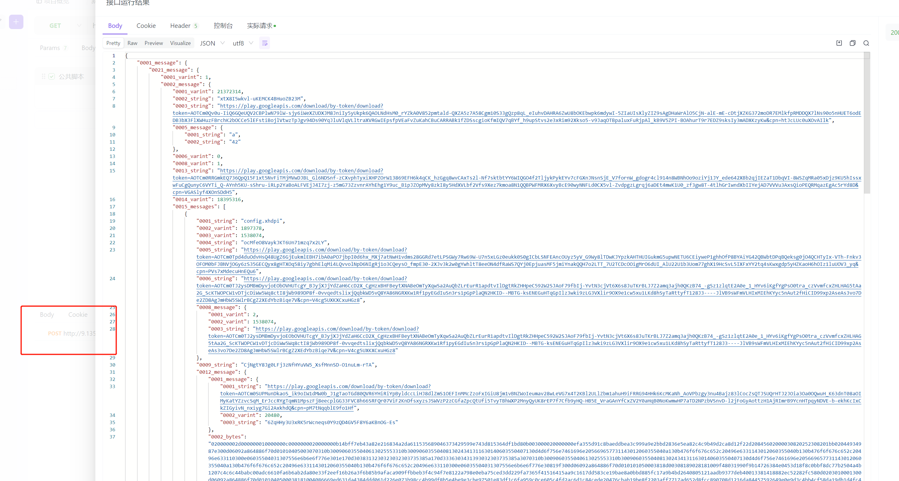

### api_fox脚本
```js
const decodeReq = {
  url: "http://127.0.0.1:8000/api_decode",
  method: "POST",
  header: pm.response.headers,
  body: {
    mode: "raw",
    raw: pm.response.stream,
  },
};

pm.sendRequest(decodeReq, function(err, res) {
    // let data = res.json()
    // console.log(data);
    // pm.environment.set("json_pb", data);
});
```


> 在控制台可查看
